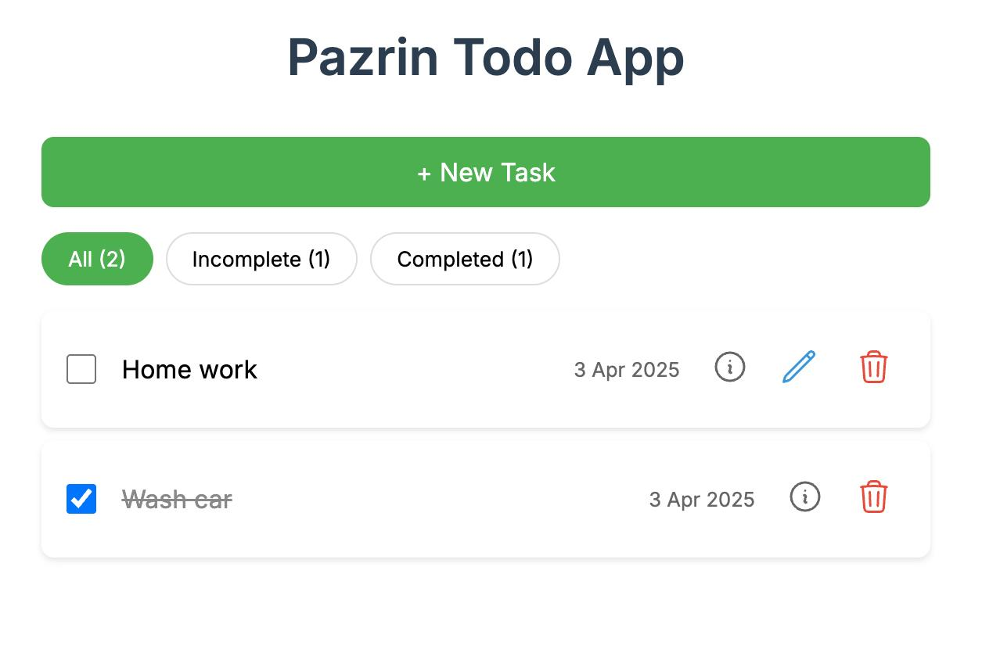

# Pazrin Todo App

A mobile-friendly todo application built with Vue 3, Pinia, and Vite featuring CRUD operations, filtering, and persistent local storage.



## Prerequisites

- Node.js (v16.x or higher recommended)
- npm (v8.x or higher) or yarn
- Git (for cloning repository)

## Installation

1. Clone the repository:
```bash
git clone https://github.com/ryfazrin/vue-todo-app.git
```

2. Navigate to project directory:
```bash
cd vue-todo-app
```

3. Install dependencies:
```bash
pnpm install
```

## Running the Project

### Development Server
```bash
pnpm run dev
```

The app will be available at:
[http://localhost:5173](http://localhost:5173)

### Production Build
```bash
pnpm run build
```

### Preview Production Build
```bash
pnpm run preview
```

## Technologies Used

- 🖼️ Vue 3 (Composition API)
- 🏪 Pinia (State Management)
- ⚡ Vite (Build Tool)
- 💅 SweetAlert2 (Modals/Notifications)
- ✨ Heroicons (Icons)
- 📦 Local Storage (Data Persistence)

## Project Structure

```
vue-todo-app/
├── src/
│   ├── components/
│   │   ├── CreateModal.vue
│   │   ├── FilterButtons.vue
│   │   ├── TodoItem.vue
│   │   └── TodoList.vue
│   ├── stores/
│   │   └── todo.js
│   ├── App.vue
│   └── main.js
├── public/
├── package.json
└── vite.config.js
```

## License

This project is licensed under the MIT License - see the [LICENSE](LICENSE) file for details.